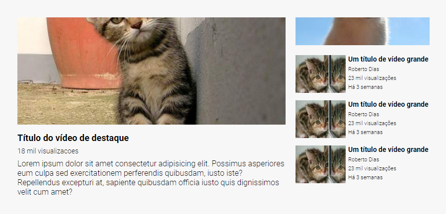

# Lista de Imagens / Pinturas
Trata-se de um layout criativo baseado no Youtube, mesclando display grid e flex! 🚀

[](https://google.com)

## Tecnologias Utilizadas
- HTML
- CSS

## Como Utilizar

1 - Clone o projeto
```
git clone <url>
```

2 - Acesse a pasta do projeto

```
cd 07-layout-youtube
```